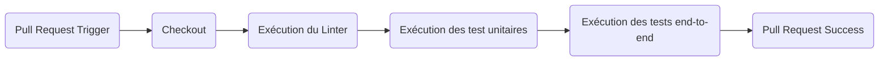
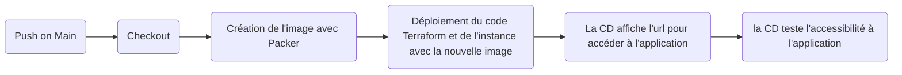

# TP-DEVOPS
Un TP pour s'approprier les outils DevOps

<p align="center">
  
</p>

## Objectifs du TP

Le repository ci-présent contient le code source d'une application web en Node.js 16. L'application expose une REST
API pour la calculer la suite de Fibonacci:

Pour installer Node.js, vous pouvez installer et utiliser [NVM](https://github.com/nvm-sh/nvm).

Installation des dépendances, dont celles de dev :

```
$ npm install --dev
```

Installation des dépendances, sans celles de dev :

```
$ npm install --omit dev
```

Démarrage du serveur :

```
$ npm start

> tp-devops@1.0.0 start
> node index.js

Server 55795 running !
```

Requête HTTP au serveur:

```
$ curl http://localhost:1234/20 -H "Content-Type: application/json"
{"entry":"20","result":6765}
```

Le code source contient également des tests (linter, unitaires, end-to-end) pour assurer la robustesse du code

A partir de cet existant, en groupe de 4 élèves, le but est de créer un workflow d'intégration continue/déploiement 
continu (CI/CD) sous Github Action:

- Le workflow de CI va permettre de tester la non-régression du code de l'application avant le merge
  d'une pull request.
- Le workflow de CD va permettre de créer un artifact et le déployer sur le cloud Azure lorsqu'une pull request
  est mergée sur la branche main.

Pour accomplir cette mission, vous devrez travailler en équipe en vous organisant et en vous séparant les tâches dans un 
[Trello](https://trello.com/). Le but est de découvrir les outils liés au DevOps et de comprendre leurs interactions.

Vous forkerez ce repository pour travailler dessus, configurerez les accès aux membres de votre équipe.
Attention à ne pas stocker de données sensibles dans votre repo.

### Workflow d'Intégration Continue (CI)

Lorsqu'une pull request est ouverte sur le repository, ce workflow se déclenche et exécute la série d'actions (jobs) 
suivantes:



Si la CI est ok (pas d'erreurs), il est possible de merger la pull request sur la branche de destination.

Les tests sont définis dans le fichier `packages.json`:
* linter: `npm run lint`
* tests unitaires: `npm run test-unit`
* tests end-to-end: `npm run test-e2e`

Le workflow de CI est à définir dans `.github/ci.yml`


### Provisionnement de la Configuration avec Ansible

<p align="center">
  
</p>

[Ansible](https://www.ansible.com/) est un outil d'automatisation et d'orchestration open-source. Vous allez utiliser Ansible pour 
automatiser l'installation de l'application sur Ubuntu 22.04. Vous devrez écrire un 
[playbook Ansible](https://docs.ansible.com/ansible/latest/playbook_guide/playbooks_intro.html) pour une exécuter
une série de tâches nécessaires pour l'installation et la configuration. Le code Ansible sera placé dans 
`.devops/ansible`. 

Voici les tâches que devra faire le playbook:
1. Installation de Node.js 16 LTS
2. Installation de NPM
3. Faire un clone de ce repository git dans `/var/www/fibonacci-api`
4. Installer les dépendances de l'application à partir du fichier `package.json` (sans inclure celles de développement)
5. Création d'un utilisateur et d'un groupe s'appelant `fibonacci`
6. Création d'un service systemd `fibonacci` qui démarrera l'application automatiquement au démarrage du serveur 
et qui utilisera l'utilisateur et le groupe `fibonacci`.
7. Démarrage du service systemd `fibonacci`

#### Développement en local

Afin de pouvoir tester facilement le playbook en local, vous pouvez utiliser [Vagrant](https://www.vagrantup.com/). Vagrant permettra de 
lancer une machine virtuelle (VM) sous Ubuntu 22.04 pour tester votre code.

Pour lancer la VM, aller dans `.devops/vagrant` et exécuter la commande suivante:

```
$ vagrant up
```

Une fois la VM démarrée, vous devez récupérer les paramètres de connexion SSH à utiliser à utiliser par Ansible:

```
$ vagrant ssh-config
Host default
HostName 127.0.0.1
User vagrant
Port 2222
UserKnownHostsFile /dev/null
StrictHostKeyChecking no
PasswordAuthentication no
IdentityFile .vagrant/machines/default/virtualbox/private_key
IdentitiesOnly yes
LogLevel FATAL
```

Dans la sortie de la commande, il y a quatre informations importantes à récupérer:
1. Le HostName: `127.0.0.1`
2. L'utilisateur: `vagrant`
3. Le port: `2022`
4. L'emplacement de la clé SSH privée (`IdentityFile`)

Tester ces informations avec une connexion SSH manuelle:

```
$ ssh vagrant@127.0.0.1 -p 2222 -i <IdentityFile>
```

Maintenant que les paramètres de connexion sont validés, appliquez les à Ansible:

```
$ ansible-playbook .devops/ansible/main.yaml -i 127.0.0.1, -e ansible_ssh_user=vagrant -e ansible_ssh_port=2222 -e ansible_ssh_private_key_file=<IdentityFile>
```

Pour revenir à l'état initiale de la VM:

```
$ vagrant destroy
$ vagrant up
```

#### Ressources

- https://www.tutorialspoint.com/ansible/ansible_playbooks.htm
- https://docs.ansible.com/ansible/2.9/modules/modules_by_category.html

### Création d'une Machine Image Azure avec Packer

<p align="center">
  
</p>

Une fois le playbook Ansible écrit, la suite est de créer une machine image. Cette image sera réutilisée
pour déployer une instance Azure contenant l'application. L'image agit comme un artifact immutable et permet 
d'avoir un démarrage plus rapide du serveur.

Vous allez utiliser [Packer](https://www.packer.io/), un outil open-source qui permet de créer des images chez plusieurs fournisseurs
à partir d'une même définition. Dans son fonctionnement, Packer va démarrer une instance, lancer le code Ansible et 
ensuite effectuer un snapshot afin de créer une image réutilisable.

Le code pour Packer devra être placé dans `.devops/packer`.

L'image générée devra comporter un timestamp pour identifier quelle est la plus récente.

#### Resources

- https://developer.hashicorp.com/packer/downloads
- https://developer.hashicorp.com/packer/guides/hcl
- https://learn.microsoft.com/fr-fr/azure/virtual-machines/linux/build-image-with-packer
- https://developer.hashicorp.com/packer/plugins/builders/azure/arm
- https://developer.hashicorp.com/packer/plugins/provisioners/ansible/ansible-local

### Provisioning de l'Infrastructure avec Terraform

<p align="center">
  
</p>

L'application devra être livrée sur une instance Azure. Cela va nécessiter également d'autres ressources pour son
bon fonctionnement. L'infrastructure sera gérée "as code" grâce à [Terraform](https://www.terraform.io/). Le code
sera placé dans le répertoire `.devops/terraform`.

Pour déployer l'application, vous aurez besoin de configurer les resources suivantes (non-exhaustif):
- [azurerm_resource_group](https://registry.terraform.io/providers/hashicorp/azurerm/latest/docs/resources/resource_group)
- [azurerm_virtual_network](https://registry.terraform.io/providers/hashicorp/azurerm/latest/docs/resources/virtual_network)
- [azurerm_public_ip](https://registry.terraform.io/providers/hashicorp/azurerm/latest/docs/resources/public_ip)
- [azurerm_network_interface](https://registry.terraform.io/providers/hashicorp/azurerm/latest/docs/resources/network_interface)
- [azurerm_virtual_machine](https://registry.terraform.io/providers/hashicorp/azurerm/latest/docs/resources/virtual_machine)

Remarques:
- La resource azurerm_resource_group devra être la même que Packer utilise pour créer l'image.
- L'instance Azure utilisera une IP publique pour être accessible. Vous pourrez utiliser un DNS dans un deuxième temps.
- Pour éviter les conflits, le fichier de state de Terraform devra être stocké dans un [backend Azure](https://developer.hashicorp.com/terraform/language/settings/backends/azurerm)
- **Pensez à bien détruire les resources Terraform lorsque vous ne travaillez pas le TP avec `terraform destroy`**.

#### Ressources

- https://developer.hashicorp.com/terraform/tutorials/azure-get-started
- https://blog.cellenza.com/cloud-2/azure/provisionner-votre-infrastructure-azure-avec-terraform/

### Workflow de Déploiement Continu (CD)

Le workflow de CD va permettre de déployer l'application sur l'infrastructure. Le workflow va faire la glue 
entre Ansible, Packer et Terraform. Le workflow de CD sera défini dans le fichier `.github/cd.yml`.

On peut imaginer les étapes suivantes pour ce workflow:


Vous pourrez utiliser les GitHub Actions suivantes:

- https://github.com/hashicorp/setup-packer
- https://github.com/hashicorp/setup-terraform


